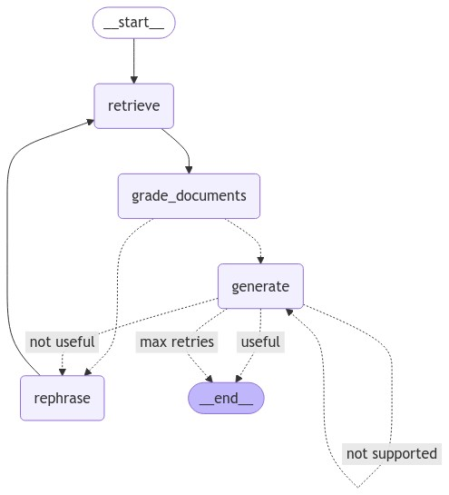

# EverRAG: Unlock the Power of Your Own Knowledge with Effortless Insight

EverRAG transforms your Evernote into an intelligent, searchable database. If you’re a dedicated note-taker, you know the truth: most of those brilliant ideas, thoughts, and insights get buried over time, never to be seen again. With EverRAG, all those valuable notes come to life.

Imagine having the ability to ask questions, get answers: Instantly tap into years of your own ideas and reflections. Need a summary, fresh insights, or a reminder of what you once thought? Just ask.

With EverRAG, your ideas don’t just get stored—they become an active part of your thinking process, ready to fuel your next big breakthrough.

EverRAG is a self-RAG locally hosted fed on your Evernote

# Setup

## Clone the repo

* Clone the repo
* Create a virtual environment
* install the requirements with

`pip install -r requirements.txt`  

## Export your Evernote notebook as html files

In Evernote, right click your notebook, and click: "export notebook as..." and choose "Multiple web pages (.html)"

## Configure the conf.json file

In that file, update the directory name to yours
Update the question to be asked by whatever you want

## Run

`python state_graph.py`

# Result example: 

# RAG graph workflow

